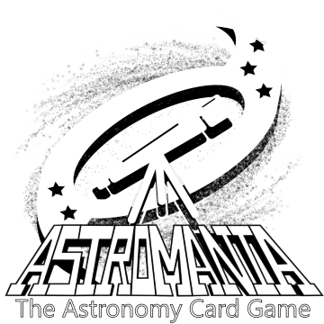
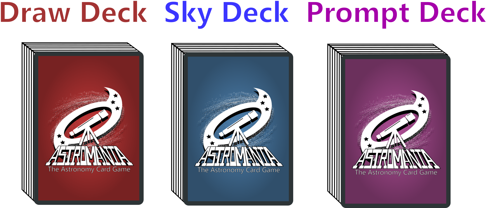
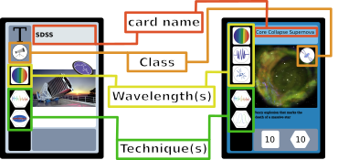
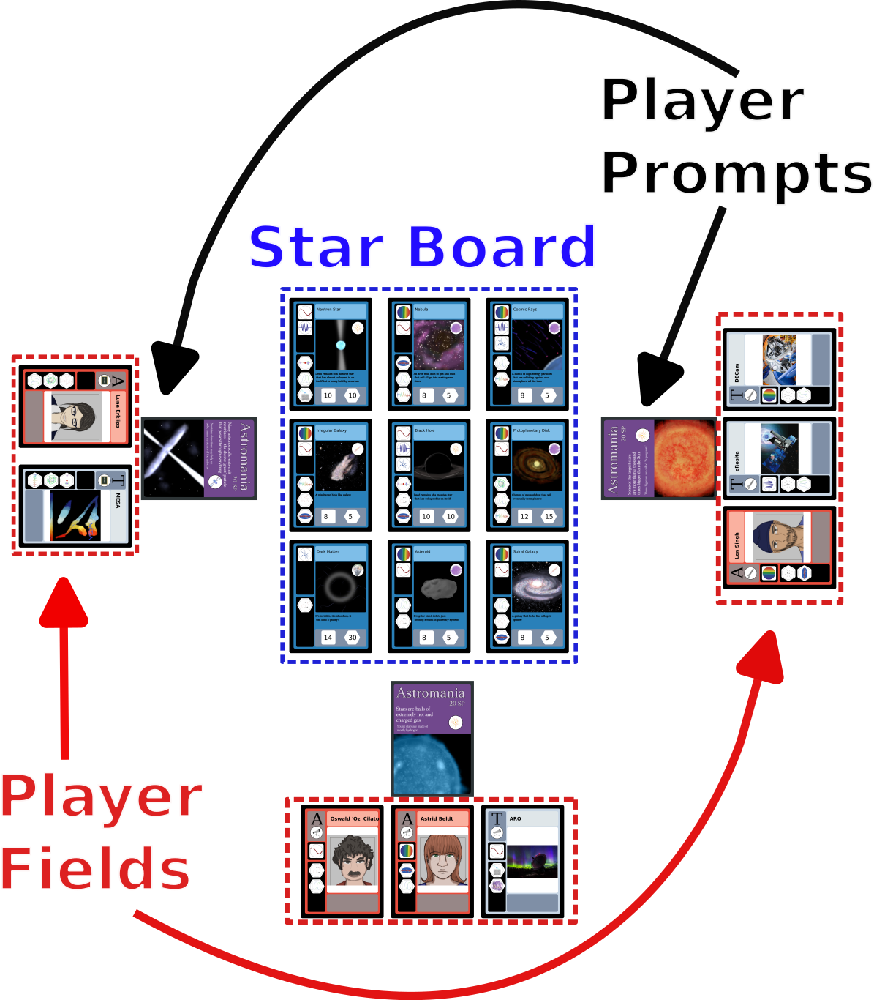
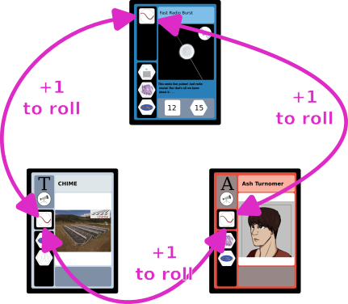

# How to Play Astromania: The Astronomy Card Game

## About This Project
We originally wanted to make some trading cards to highlight contributions of queer astronomers. But if you already have a deck of fancy cards, why not make a whole game out of it? Astromania is the card game equivalent of real life astronomy research. With its assortment of object cards and tool cards, Astromania lets you strategize and combine techniques to solve the mysteries of the universe - just like a real astrophysicist! Our team is composed of graduate students who are all working towards a PhD in astronomy and are actively involved in ongoing astronomy research.

Astronomy isn’t always just taking pictures of black holes and distant galaxies. It’s a field composed of many people using different methods to study the past, present, and future of our universe. Sometimes we need to craft simulations to test our theories. Sometimes we need to write some code to calculate important statistics. Sometimes we’re caught up in the political machine that is academia. It’s not always pretty and an important part of success is luck. Things don’t always work the way you expect and so we hope we convey the research process in an accurate manner in our game.

[Here's a link to our website!](https://astromania-game.github.io/)

## The Scenario
Each player has just begun their astronomy career by being accepted to a prestigious university for graduate school. They must work hard to complete real astronomy research and publish scientific papers to graduate and receive their PhD.

## In the Box
### Decks/Cards
In this game, there are three types of cards, each separated into their own decks. The decks can be distinguished by the color of the card backs. The Draw Deck (red) are the cards that players will draw from to add cards to their hands. The Sky Deck (blue) are where object cards for the Starboard are drawn from. The Prompt Deck (purple) holds all the potential prompts for the game. 

The exact count of each is as follows:
- Draw deck (42 cards):
  - 18  Astronomer Cards
  - 15 Tool Cards
  - 9 Interact Cards
- Prompt deck (18 cards)
- Sky deck (30 cards)

#### Card Layouts

- Classes - Icons in circles. General classification of a card.
- Wavelengths - Icons in squares. Represents the wavelengths in which can be studied
- Techniques - Icons in hexagons. Represents scientific techniques used to analyze objects

        Astronomer Cards (Class, 1-3 Wavelengths, 1-3 Techniques), Tool Cards (Class, 0-1 Wavelengths, 2-3 Techniques), Prompt Cards (Class), Object Cards (Class, 1-3 Wavelengths, 1-3 Techniques)

### Dice
We include two fair 6 sided dice to be used for our game.

### SP Trackers
We include trackers to keep track of a player’s earned bonus science points (SP). There are markers to represent 1, 5, and 10 SP. There are 24 of each value included.

## Setup
*Optional*: Remove the interact cards from the draw deck for solo play.
1. Split the cards into their appropriate decks by their back color and shuffle all 3 decks.
2. Distribute a random prompt card to each player.
3. Each player draws 5 cards from the Draw deck as their starting hand.
4. Place 9 object cards from the Sky deck on the Starboard.
5. Roll the dice to determine who goes first. Turn order proceeds counter-clockwise from the first player.

## Game Layout
An example game can be seen below. All players must be able to see every card on the Starboard, every player's current prompt, and any cards played on all players' fields.

## Gameplay
### Turn Actions
On their turn, a player can take up to 3 of any of the following actions:
1. Draw a card from the draw deck
2. Play an astronomer or tool card on your field
3. Use an Astronomer card and a Tool card in your field to attempt to study an object on the Starboard (see next section)
4. Use an Interact card from your hand (discard it after use)
5. Discard a card in your hand or field and gain 1 SP

### Studying an Object
Choose one object on the Starboard to study. Select one Astronomer and one Tool (both in your field) to study the object with. Roll the dice and sum the resulting values to determine the science power for that analysis. Remember to apply any relevant bonuses!

- If your dice roll (plus bonuses) is *greater than or equal to* the value required to observe the object, you gain the intrinsic VP of the object and any bonus VP from using your actions plus any SP granted by the object card (use the SP markers to count extra SP). Add the object card to the player's pile of sucessfully studied objects. Then draw a new object card and place it on the Starboard.

- If your final roll is less than the required value to observe the object, the object remains on the board and you do not gain any SP.

Once an astronomer and/or tool is used to study an object successfully, they may not be used *together* to study a different object in the same turn. 

#### Matching Classes Bonus
If you pair the correct astronomer and tool classes, you gain +1 bonus on your roll for your attempt at studying.

You can more easily complete the prompt by studying objects of the same class as the prompt. For each object that being submitted that is of the same class as the prompt, the required SP to publish is decreased by 1.

#### Matching Wavelengths Bonus
When studying an object, a player can receive a +1 bonus to your dice roll for each match between two cards(these values can stack). The wavelength icons are in squares to indicate that their bonus is applied to rolls. For instance, let's say that player wants to study the Fast Radio Burst object with Ash Turnomer astronomer and the CHIME tool. All three have the long-wavelength in their wavelengths, so there is a +3 to the roll from matching wavelengths. (Additionally, there is another +1 to the roll from matching an observer to a telescope.)

#### Matching Techniques Bonus
When studying an object, a player can pair the match the techniques, you gain +1 bonus SP on a sucessful study. The technique icons are in hexagons to indicate that their bonus is in the resulting SP. Like with matching wavelengths, players may stack the bouses from multiple matches. 

### Publishing a Paper
When a player has the required SP to fulfill their prompt (value listed on the prompt card), they can publish a paper! A player must publish on their turn, but publishing does not require an action.

To publish: Object cards in a player's pile of sucessfully studied objects are worth the amount of SP listed in the hexagon. A player must trade in enough object cards and SP tokens to fulfill the prompt. If the value of the SP being traded in is greater than the value required to publish, the player receives SP tokens representing the excess. 

The used objects then go into the sky deck discard pile. The player then selects another random prompt from the prompt deck, unless it is their third publication.

### Additional Rules
- **Hand limit:** A player cannot have more than 7 (seven) cards in their hand at the end of their turn. If they have greater than this limit at the end of their turn, they must discard cards of their choice such that they only have 7 (seven) cards. The player does not gain SP for these discards.
- **Field limit:** A player cannot have more than 3 Astronomers and 3 Tools on their field at any given time.
- **Re-shuffling:** When either the draw or sky deck is empty, re-shuffle the cards in the corresponding discard and place it in the deck location.

## How to Win
The first player to publish 3 (three) papers wins and successfully receives their PhD in Astronomy (within the realm of the game)! 
