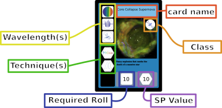
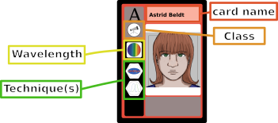
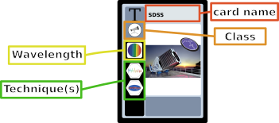
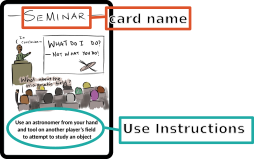
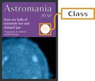

# How to Play Astromania: The Astronomy Card Game

## About This Project
We originally wanted to make some trading cards to highlight the contributions of queer astronomers. But if you already have a deck of fancy cards, why not make a whole game out of it? Astromania is the card game equivalent of real-life astronomy research. With its assortment of object cards and tool cards, Astromania lets you strategize and combine techniques to solve the mysteries of the universe - just like a real astrophysicist! Our team is composed of graduate students who are all working towards a Ph.D. in astronomy and are actively involved in ongoing astronomy research.

Astronomy isn’t always just taking pictures of black holes and distant galaxies. It’s a field composed of many people using different methods to study the past, present, and future of our universe. Sometimes we need to craft simulations to test our theories. Sometimes we need to write some code to calculate important statistics. Sometimes we’re caught up in the political machine that is academia. It’s not always pretty and an important part of success is luck. Things don’t always work the way you expect and so we hope we convey the research process in an accurate manner in our game.

Here's a link to our website: [https://astromania-game.github.io/](https://astromania-game.github.io/)

## The Scenario
In our game, each player has just begun their astronomy career by being accepted to a prestigious university for graduate school. They must work hard to complete real astronomy research and publish scientific papers to graduate and receive their Ph.D.

## In the Box
### Decks/Cards
In this game, there are three types of cards, each separated into their own decks. The decks can be distinguished by the color of the card backs. The Draw Deck (red) are the cards that players will draw from to add cards to their hands. The Sky Deck (blue) is where object cards for the Starboard are drawn from. The Prompt Deck (purple) holds all the potential prompts for the game. 

The exact count of each is as follows:
- Sky deck (30 cards)
- Draw deck (42 cards):
  - 18  Astronomer Cards
  - 15 Tool Cards
  - 9 Interaction Cards
- Prompt deck (18 cards)

### Dice
We include two fair 6-sided dice to be used for our game.

### SP Trackers
We include trackers to keep track of a player’s earned bonus science points (SP). There are markers to represent 1, 3, and 5 SP. There are 18 of each value included.

## Card Layouts

Generally seaking, the type of icon can be determined by what shape it is within.
- Classes - Icons in circles. General classification of a card.
- Wavelengths - Icons in squares. Represents the wavelengths which can be studied
- Techniques - Icons in hexagons. Represents scientific techniques used to analyze objects
 
### Objects
Object Cards have one Class, 1-3 Wavelengths, and 1-3 Techniques.

### Astronomers
Astronomer Cards have one Class, 1-3 Wavelengths, and 1-3 Techniques.

### Tools
Tool Cards have one Class, 0-1 Wavelengths, and 2-3 Techniques.

### Interactions
Interaction cards will have none of the regular icons on them. Instead, there are instructions about what the card can be used to do.

### Prompts
Prompt Cards only have one Class associated with them. These classes are the same as the Object classes.

### Reference
Each player has one refernce card that they may refer back to at any time.

## Setup
*Optional*: Remove the interaction cards from the draw deck for solo play.
1. Split the cards into their appropriate decks by their back color and shuffle all 3 decks.
2. Distribute a random prompt card to each player.
3. Each player draws 5 cards from the Draw deck as their starting hand.
4. Place 9 object cards from the Sky deck on the Starboard.
5. Determine who goes first. Turn order proceeds clockwise from the first player.
   - This can be done in any way you choose. You may decide that whoever was the last person to see a shooting star or whoever has the next birthday goes first. We suggest each player take a turn rolling the dice and the player with the highst sum on the dice goes first.

## Game Layout
An example game can be seen below. All players must be able to see every card on the Starboard, every player's current prompt, and any cards played on all players' fields.

The maximum size of a player's field depends on how many many papers that player has published. A player begins with a field limit of 1 Astronomer + 1 Tool. For each paper that the player published, their field limit increases by 1 Astronomer and 1 Tool. For instance, if a player has published 2 papers thus far, their field limit is 3 Astronomers + 3 Tools.

## Gameplay
### Turn Actions
On their turn, a player can take up to 3 turn actions plus one free action.

Once per turn, a player may do **one** of the following as a free action (does not count towards your 3 turn actions):
- Draw only one card from the draw deck
- Discard only one card in their hand or field and gain +2 SP

At the cost of one turn action, a player may do any one of the following:
1. Draw a card from the draw deck
2. Play an astronomer or tool card on your field
3. Use an Astronomer card and a Tool card in your field to attempt to study an object on the Starboard (see next section)
4. Discard a card in their hand or field and gain +2 SP

A player may use any number of Interaction Cards without any action cost unless specified by the card. Once an Interaction Card is used, it is placed in the Draw Deck's discard pile.

A player may take their turn in any order they so wish. Players are not required to use their free action seperate from their turn actions. A player may choose to do 2 turn actions, use their free action, and then do their last turn action. Even after that, a player may use an Interaction Card (so long as it does not require any actions). A player's turn is not finished until they declare that they are done.

### Studying an Object
Choose one object on the Starboard to study. Select one Astronomer and one Tool (both in your field) to study the object with. Roll the dice and sum the resulting values to determine the science power for that analysis. Remember to apply any relevant bonuses!

- If your dice roll (plus bonuses) is *greater than or equal to* the value required to observe the object, you gain the intrinsic SP of the object in the form of the object card itself and any bonus SP granted by matching techniques (use the SP markers to count extra SP). Add the object card to the player's SP cache. Each object is worth the intrinsic SP (number in the hexagon). Then draw a new object card and place it on the Starboard.

- If your final roll is less than the required value to observe the object, the object remains on the board and you do not gain any SP.

Once an astronomer is used to *attempt* to study an object, they may not be used to study a different object in the same turn. 

#### Matching Classes Bonus
For Astronomer/Tool clases: If you pair the correct astronomer and tool classes, you gain +1 bonus to your dice roll for your attempt at studying.

For object classes: You can more easily complete the prompt by studying objects of the same class as the prompt. For each object that is being submitted that is of the same class as the prompt, the SP worth of that object towards publishing is increased by +1.

#### Matching Wavelengths Bonus
When studying an object, a player can receive a +1 bonus to your dice roll for each match with the object card (these values can stack). The wavelength icons are in squares to indicate that their bonus is applied to rolls. For instance, let's say that a player wants to study the Fast Radio Burst object with Ash Turnomer astronomer and the CHIME tool. Ash and CHIME each have the long-wavelength in their wavelengths which matches Fast Radio Burst, so there is a +2 to the roll from matching wavelengths. (Additionally, there is another +1 to the roll from matching an observer to a telescope, so they player would have a total of +3 to their roll on their study attempt.)

#### Matching Techniques Bonus
When studying an object, a player can pair the match the techniques, you gain +1 bonus SP on a successful study. The technique icons are in hexagons to indicate that their bonus is in the resulting SP. Players may stack the bonuses from multiple matches to the object.

### Publishing a Paper
When a player has the required SP to fulfill their prompt (20 SP listed on the Prompt Card), they can publish a paper! A player must publish on their turn, but publishing does not require using an action.

To publish: Object cards in a player's SP cache are worth the amount of SP listed in the hexagon. A player must trade in enough object cards and SP tokens to fulfill the prompt. 

If an object being traded in has the same class icon as the prompt, then the object is worth an additional 1 SP towards that prompt.

If the value of the SP being traded in is greater than the value required to publish, the player receives SP tokens representing the excess. 

The used objects then go into the Sky Deck discard pile. The player then selects another random prompt from the prompt deck, unless it is their third publication...

### Additional Rules
- **Field limit:** The number of Astronomers and Tools that a player may have on their field depends on how many papers that player has published (# of paper published + 1). A player can never have more than 3 Astronomers and 3 Tools on their field at any given time.
- **Hand limit:** A player cannot have more than 7 (seven) cards in their hand at the end of their turn. If they have greater than this limit at the end of their turn, they must discard cards of their choice such that they only have 7 (seven) cards. The player does not gain SP for these discards.
- **Re-shuffling:** When either the draw or sky deck is empty, re-shuffle the cards in the corresponding discard and place it in the deck location.

## How to Win
The first player to publish 3 (three) papers wins and successfully receives their PhD in Astronomy (within the realm of the game)! 
