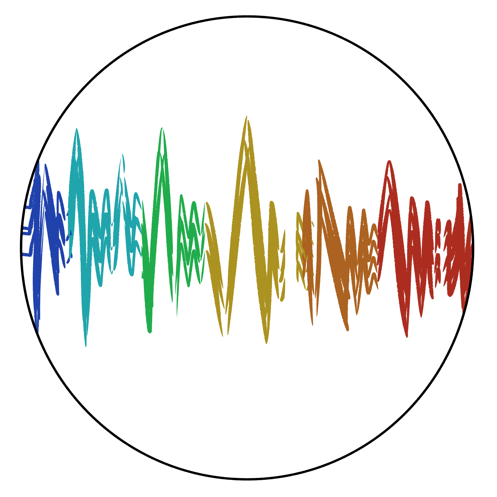
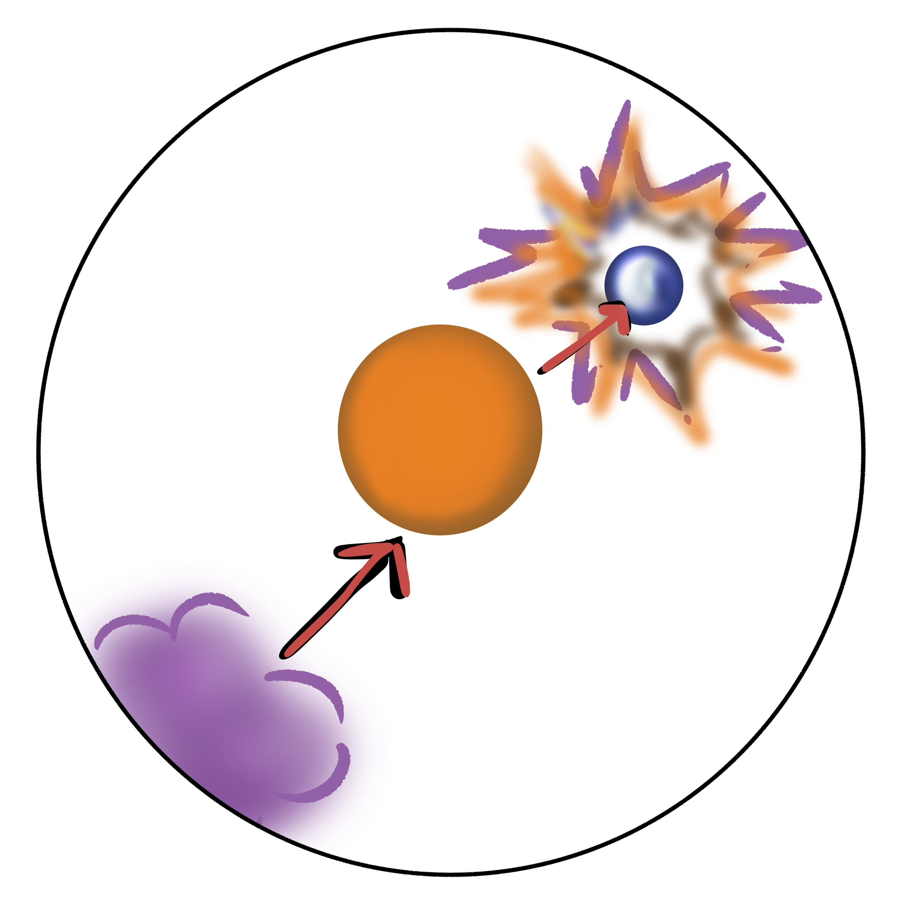
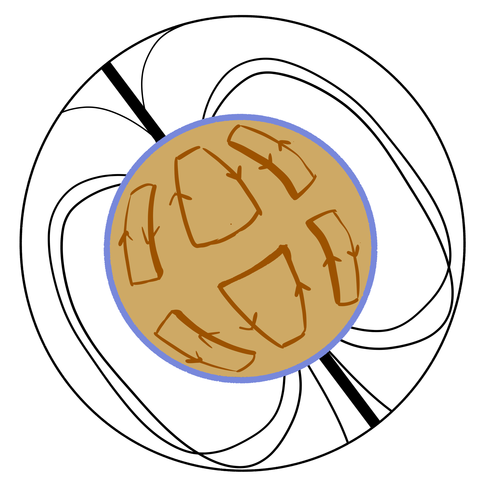

| Astronomer/Tool Class  | Icon |
| ----------- | ----------- |
| Observer/Telescope    |     |
| Instrumentalist/Instrument   |      |
| Theorist/Simulation  |   |

| Object/Prompt Class  | Icon |
| ----------- | ----------- |
| ISM    |      |
| Transient   |      |
| Star    |      |
| Cosmology   |      |
| Planet   |      |
| Galaxy   |      |

| Wavelength  | Icon |
| ----------- | ----------- |
| Optical    |       |
| Long Wavelength    |       |
| High Energy    |       |
| Multi-Messenger   |       |

| Technique  | Icon |
| ----------- | ----------- |
| Photometry   |       |
| All-Sky  |       |
| Spectroscopy   |       |
| Dark Enenergy Study   |       |
| Scintillometry   |       |
| Population Study  |       |
| Astrometry   |       |
| Evolution   |       |
| MHD |       |