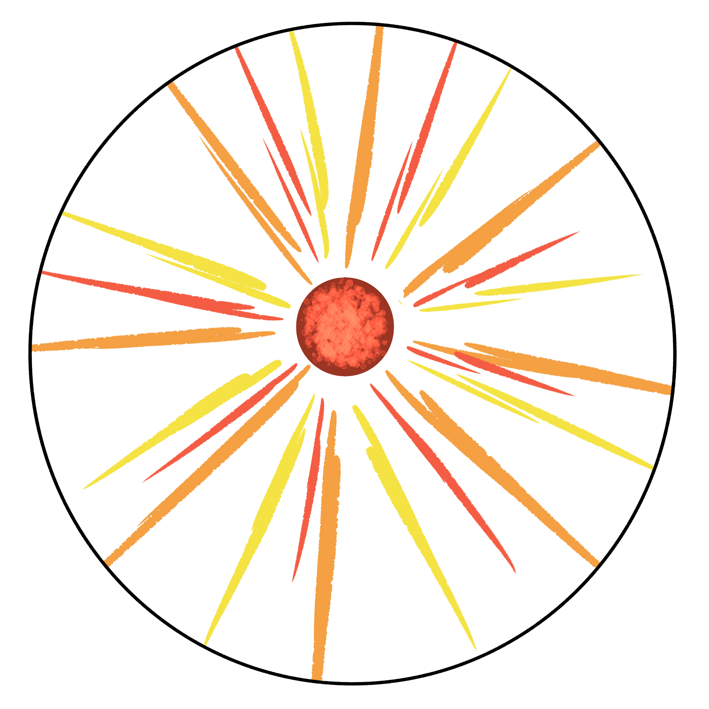
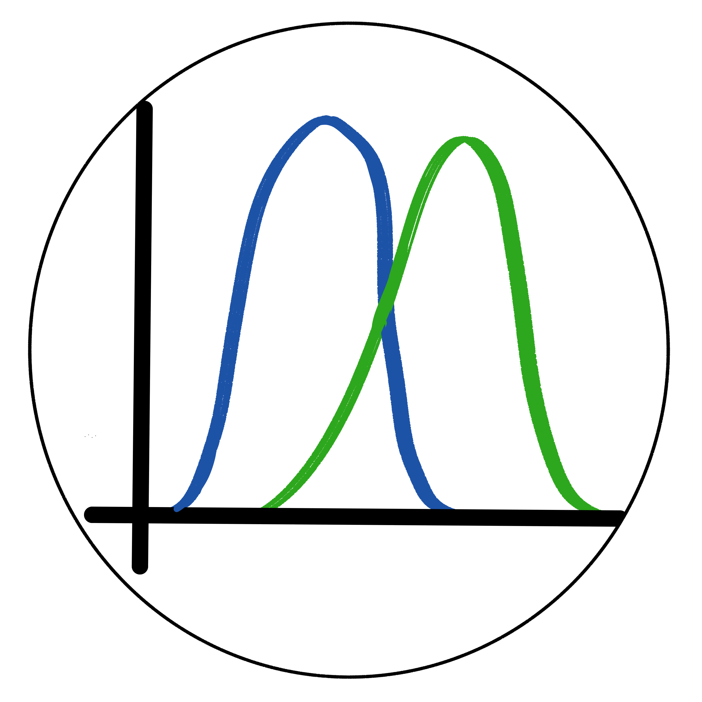

| Astronomer/Tool Class  | Icon | Description |
| ----------- | ----------- | ----------- |
| Observer/Telescope    |     | Icon for Observer class Astronomers and Telescope class tools |
| Instrumentalist/Instrument   |      | Icon for Instrumentation class Astronomers and Instrument class tools |
| Theorist/Simulation  |   | Icon for Theorist class Astronomers and Code/Simulation/Software Instrument class tools |

| Object/Prompt Class  | Icon | Description |
| ----------- | ----------- | ----------- |
| ISM    |      | Icon for Interstellar Medium (ISM) class objects |
| Transient   |      | Icon for Transient class objects |
| Star    |      | Icon for Star class objects |
| Cosmology   |      | Icon for Cosmology class objects |
| Planet   |      | Icon for Planet class objects |
| Galaxy   |      | Icon for Galaxy class objects |

| Wavelength  | Icon | Description |
| ----------- | ----------- | ----------- |
| Optical    |       | Icon for tools that can detect visible/optical wavelengths. Also for objects that emit in visible/optical wavelength |
| Long Wavelength    |       | Icon for tools that can detect long wavelength (IR and longer). Also for objects that emit in long wavelength (IR and longer)|
| High Energy    |       | Icon for tools that can detect short wavelength (UV and shorter). Also for objects that emit in long wavelength (UV and shorter)|
| Multi-Messenger   |       | Icon for tools that can detect multi-messenger sources. Also for objects that can be detected through multi-messenger astronomy.|

| Technique  | Icon | Description |
| ----------- | ----------- | ----------- |
| Photometry   |       | Icon for tools that can do photometry or objects that photometry can be done on |
| All-Sky Survey  |       | Icon for tools that can be used to make all-sky maps or objects that can show up on all-sky survey |
| Spectroscopy   |       | Icon for tools that can do spectroscopy or objects that spectroscopy can be done on |
| Dark Energy Study   |       | Icon for tools that can study Dark Energy and the technique to study Dark Energy |
| Scintillometry   |       | Icon for tools that can do scintillometry or objects that scintillometry can be done on |
| Population Study  |       | Icon for tools capable of studying populations of an objects or objects that reveal different physics if one studies groups of them  |
| Astrometry   |       | Icon for tools that can do astrometry or objects that astrometry can be done on |
| Evolution   |       | Icon for tools capable of modelling evolution of an object or objects who's evolutions can be modelled |
| MHD |       | Icon for tools capable of modelling hydrodynamics or objects that can be modelled through through hydrodynamical approximations |
| Polarimetry |       | Icon for tools that can do polarimetry or objects that polarimetry can be done on |
